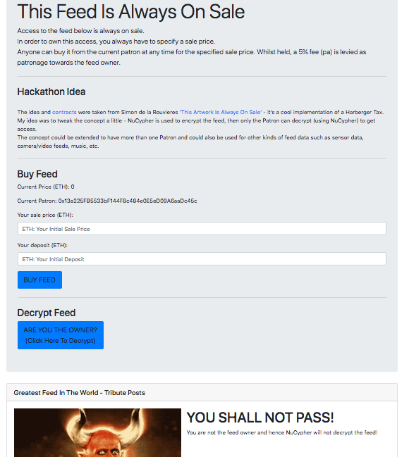

## This Feed Is Always On Sale

[Demo Video](https://www.youtube.com/watch?v=aCp4QVIi9IM&feature=youtu.be)

Welcome to my NuCypher Hackathon entry. Inspired by Simon de la Rouvieres [This Artwork Is Always On Sale](https://thisartworkisalwaysonsale.com) where he implements a Harberger Tax on the ownership of a digital artwork. In my app, instead of an Artwork, access to a feed of data is always for sale. NuCypher is used to encrypt the data and only the current Patron can decrypt (using NuCypher) to get access. Anyone can buy this access from the current Patron for the sale price set when they took ownership. Whilst they hold ownership they pay a 5% fee to the feed owner.
In this demo app the data is a Twitter like feed but the concept could be extended to have more than one Patron and could also be used for other kinds of feed data such as sensor data, camera/video feeds, music, etc.

## How To Run Locally

The Smart Contract used are taken directly from This Artwork Is Always On Sale.

Clone [This Artwork Is Always On Sale](https://github.com/simondlr/thisartworkisalwaysonsale)

$ cd thisartworkisalwaysonsale

Start local blockchain:

$ npm run chain

Deply contracts:

$ truffle migrate

Note address of ERC721Full and ArtSteward contracts.

Clone this project locally.

Now change to your local project and run the app:

$ cd project

$ python manage.py makemigrations

$ python manage.py migrate

$ python manage.py createsuperuser

$ python manage.py runserver

App will be available at: http://127.0.0.1:8000/

Login to admin page at: http://127.0.0.1:8000/admin

Update the Art Steward and ERC721 contract addresses under feed.

On browser change MetaMask to Localhost 8545.

Browse to http://127.0.0.1:8000/feed_admin and click 'Create Policy'.
This will start a NuCypher policy locally and add some example encrypted posts.

Play around on the main feed page with buying Patronage and decrypting posts and try adding new posts in feed_admin.

## Some Issues I Came Across During The Hackathon

### Deployment
Deployment to the likes of Heroku/PythonAnyWhere doesn't work because of high resource requirements.

Form Justin:
The thing is: We use scrypt to dervive the material which is then used to derive keypairs for Alice to use to delegate. This fills up a gig of RAM (sometimes more) for several seconds. I'm sure heroku is not happy about that. We are working to optimize this process, but no matter what we do, we want it to use a bunch of RAM and we want it to take about 3-5 seconds because it's essential that this not be vulnerable to a brute force attack. I'm not sure exactly what to tell you right now. You can run it locally or use something like Digital Ocean or AWS where you can get a little more horsepower. But again, you only need it for a few seconds. In the future, we're planning to add a "Cone of Silence" for this part - maybe we'll let you do the derivation on your local machine so that you can run the rest of the app in a more lightweight environment. Presently, we don't have a good solution for you.

### Requirement For Persistent Alice, etc
After a lot of failed experimentation it became clear that Alice really needs to be persistent if you plan on granting access to policy, etc sometime after the app starts. I had assumed that restarting an Alice with a passphrase would mean this kind of thing was possible but it's not - passphrase protects Alice's private keys, but these are different for each Alice. I feel like this could be a limitation - to keep a 100% uptime Alice running will be pretty hard and most use cases I thought of would require changes to Policy access over time. I was trying to do the following originally:

* Start Alice1(passphrase1) -> Create Policy
* Enrico encrypts data using policy info Sometime later I want to add a * Bob to policy and allow him to decrypt Enrico data (i.e. Alice1 has stopped)
* Start new Alice with same passphrase, Alice2(passphrase1)
* Alice2 grantPolicy for Bob.
* Bob joins policy using Alice2_pubkey
* Bob try to retrieve data using using Alice2_pubkey Gets an error - nucypher.characters.lawful.Bob.IncorrectCFragReceived: <nucypher.policy.models.IndisputableEvidence object at 0x112f71f28> The two Alices have different Pub keys.

### Django/Persistent Alice Issue I Never Got To The Bottom Of

With a persistent Alice running in Django I keep getting this weird error -

Internal Server Error: /decrypt/ Traceback (most recent call last): File "/Users/johngrant/Documents/thisfeedisalwaysforsale/lib/python3.7/site-packages/django/core/handlers/exception.py", line 34, in inner response = get_response(request) File "/Users/johngrant/Documents/thisfeedisalwaysforsale/lib/python3.7/site-packages/django/core/handlers/base.py", line 126, in _get_response response = self.process_exception_by_middleware(e, request) File "/Users/johngrant/Documents/thisfeedisalwaysforsale/lib/python3.7/site-packages/django/core/handlers/base.py", line 124, in _get_response response = wrapped_callback(request, *callback_args, **callback_kwargs) File "/Users/johngrant/Documents/thisfeedisalwaysforsale/feed/views.py", line 131, in decrypt decrypted = nuCypherBob.DecryptData(bob_one, labelStr, message_kit, enricos_pubkey, policy_pubkey, alice_pub_key) File "/Users/johngrant/Documents/thisfeedisalwaysforsale/feed/nuCypherBob.py", line 105, in DecryptData alice_verifying_key=alices_sig_pubkey File "/Users/johngrant/Documents/thisfeedisalwaysforsale/lib/python3.7/site-packages/nucypher/characters/lawful.py", line 587, in retrieve raise Ursula.NotEnoughUrsulas("Unable to snag m cfrags.") nucypher.characters.lawful.Ursula.NotEnoughUrsulas: Unable to snag m cfrags. I changed m/n for the policy to 1 and still get the same.
